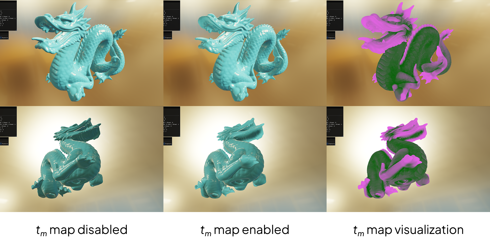
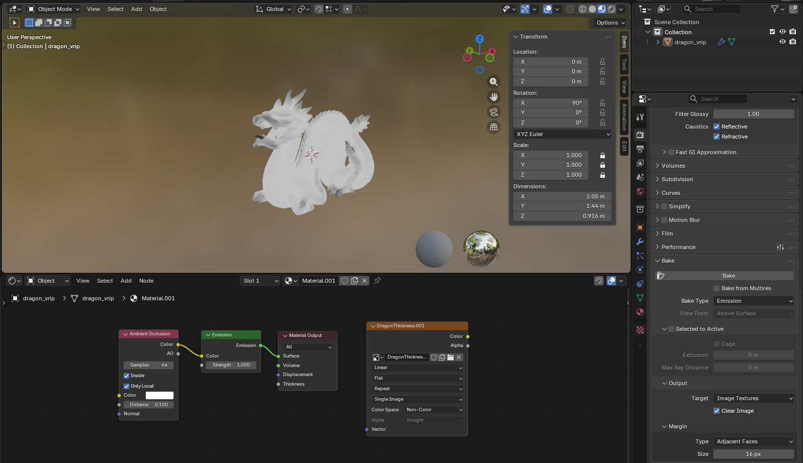

# Real-Time Subsurface Scattering with Translucency Maps

original project: https://omilab.naist.jp/project/tmsss/index.html

## Translucency Map Baking

## Dependencies
- [Bolero](https://github.com/KaindraDjoemena/Bolero)